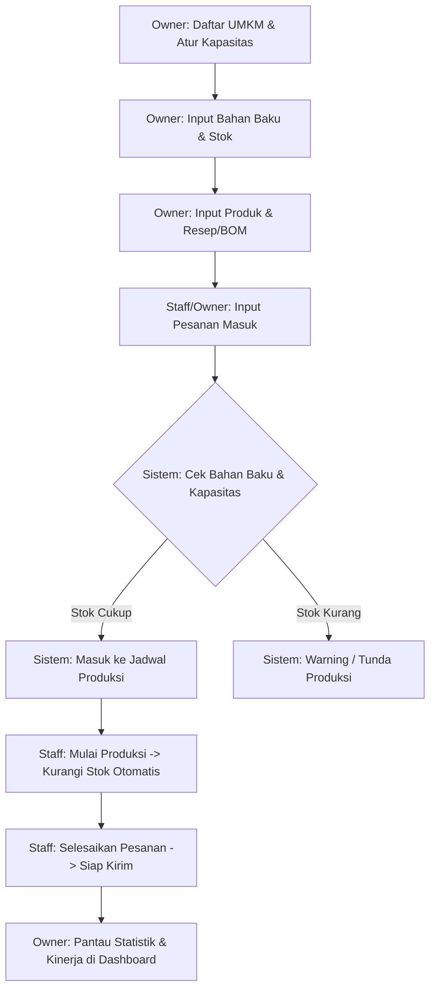

# 📘 Buku Panduan Penggunaan FoodCraft (User Manual)

Selamat datang di **FoodCraft**! Platform digital terintegrasi yang dirancang khusus untuk membantu Usaha Mikro, Kecil, dan Menengah (UMKM) makanan dalam mengelola rantai produksi, inventaris bahan baku, penjadwalan, kapasitas operasional, hingga analisis performa bisnis secara cerdas.

Dokumen ini adalah panduan lengkap agar pengguna dengan berbagai peran (**Owner**, **Staff**, dan **Super Admin**) dapat memahami cara kerja dan mengoperasikan platform ini dengan cepat.

---

## 👥 1. Peran Pengguna (User Roles) & Hak Akses

Aplikasi ini menggunakan sistem **Role-Based Access Control (RBAC)** dengan 3 jenis peran utama:

| Peran | Deskripsi Singkat | Fitur Utama yang Diakses |
| :--- | :--- | :--- |
| **Owner (Pemilik UMKM)** | Pemilik usaha makanan yang memiliki kontrol penuh atas manajemen UMKM miliknya. | Pendaftaran UMKM, Kelola Staff, Kelola Bahan Baku, Kelola Produk & Resep, Pengaturan Kapasitas Produksi, Dasbor Analitik Produksi. |
| **Staff (Karyawan)** | Anggota tim operasional yang menangani dapur, pemesanan, dan inventaris harian. | Pencatatan Pesanan (Order), Pembaruan Status Produksi (Jadwal), Cek Ketersediaan Bahan Baku. |
| **Super Admin** | Pengelola sistem global (biasanya dari penyedia SaaS FoodCraft). | Pemantauan Log Aktivitas (System Logs), Manajemen User Global, Laporan Eror Sistem. |

---

## 🔑 2. Memulai (Registrasi & Login)

### A. Pendaftaran Akun Baru (Khusus Owner)
1. Buka halaman utama FoodCraft dan masuk ke halaman `/register` (atau klik **Register here** di layar login).
2. Isi data yang diperlukan: **Nama Lengkap**, **Email**, dan **Password**.
3. Centang persetujuan syarat dan ketentuan (*Terms & Conditions*).
4. Klik tombol **Get Started Now →**.

### B. Masuk ke Aplikasi
1. Akses halaman `/login`.
2. Masukkan **Email** dan **Password** Anda.
3. Klik tombol **Sign In to FoodCraft →**.
4. Anda akan otomatis diarahkan ke dasbor yang sesuai dengan peran (*role*) Anda.

---

## 💼 3. Panduan Penggunaan untuk **Owner (Pemilik UMKM)**

Sebagai Owner, berikut adalah langkah awal untuk mengatur profil usaha Anda sebelum memulai operasional:

### Langkah 1: Mendaftarkan Profil UMKM
1. Masuk ke menu **UMKM Management**.
2. Masukkan nama UMKM, alamat dapur/produksi, kontak, dan deskripsi singkat.
3. Klik **Simpan**. Ini penting untuk membuka menu-menu manajemen produksi lainnya.

### Langkah 2: Mengelola Bahan Baku (Inventaris)
1. Masuk ke menu **Bahan Baku**.
2. Klik **Tambah Bahan Baku** untuk mendaftarkan bahan baku baru (contoh: *Tepung Terigu, Mentega, Telur*).
3. Isi **Nama Bahan**, **Stok Saat Ini**, **Satuan** (Kg, Gram, Butir), dan **Harga Satuan**.
4. Anda dapat memperbarui stok (*restock*) secara manual di menu ini ketika ada pasokan baru masuk.

### Langkah 3: Mengelola Produk & Resep (BOM - Bill of Materials)
1. Masuk ke menu **Produk**.
2. Klik **Tambah Produk** (contoh: *Roti Sobek Cokelat*), isi deskripsi, harga jual, dan estimasi waktu produksi (dalam menit).
3. Setelah produk terdaftar, masuk ke tab **Resep / BOM**.
4. Masukkan kebutuhan bahan baku untuk memproduksi **1 unit produk** tersebut (misal: *Roti Sobek membutuhkan 0.2 kg Tepung Terigu dan 1 butir Telur*).
5. Sistem akan otomatis memvalidasi apakah stok bahan baku cukup setiap kali produk ini dipesan.

### Langkah 4: Mengatur Kapasitas Produksi Dapur
1. Masuk ke menu **Kapasitas Produksi**.
2. Tentukan **Kapasitas Harian** dalam satuan menit (contoh: Dapur Anda beroperasi 8 jam sehari = 480 menit).
3. Pilih **Hari Operasi** aktif (misal: Senin - Sabtu).
4. Pengaturan ini akan digunakan oleh sistem untuk menjadwalkan pesanan secara otomatis agar tidak terjadi *overcapacity* (kelebihan beban kerja).

### Langkah 5: Mengelola Staff (Karyawan)
1. Masuk ke menu **Staff Management**.
2. Klik **Tambah Karyawan**.
3. Buatkan akun untuk karyawan Anda dengan mengisi nama, email, dan password awal.
4. Akun ini otomatis terikat ke UMKM Anda dan memiliki peran sebagai **Staff**.

### Langkah 6: Dasbor Analitik (Performance Monitoring)
* Di halaman utama dashboard Anda, Anda dapat memantau:
  * **On-Time Delivery Rate**: Persentase pesanan yang selesai tepat waktu.
  * **Kapasitas Terpakai**: Grafik utilisasi dapur hari ini.
  * **Stok Kritis**: Bahan baku yang stoknya di bawah batas aman.
  * **Rangkuman Keuangan**: Total pendapatan dan produk terlaris.

---

## 👨‍🍳 4. Panduan Penggunaan untuk **Staff (Karyawan)**

Sebagai Staff, fokus utama Anda adalah menjalankan operasional harian produksi dan memperbarui data pesanan:

### Langkah 1: Memproses Pesanan Baru (Orders)
1. Masuk ke menu **Pesanan**.
2. Ketika ada pesanan masuk, status awalnya adalah `Pending` atau `Scheduled`.
3. Pilih pesanan yang ingin dikerjakan, lalu ubah statusnya menjadi `In Production` ketika proses memasak dimulai.
4. Sistem akan otomatis mengurangi stok bahan baku di gudang berdasarkan resep yang telah diatur oleh Owner.
5. Jika pesanan selesai dimasak dan siap dikirim/diambil, ubah status menjadi `Done` atau `Completed`.

### Langkah 2: Memantau Jadwal Produksi (Penjadwalan Otomatis)
1. Masuk ke menu **Jadwal Produksi**.
2. Lihat daftar urutan pengerjaan produk berdasarkan estimasi waktu selesai.
3. Ikuti urutan prioritas yang disarankan sistem (berdasarkan deadline pesanan) untuk meminimalkan keterlambatan produksi.

### Langkah 3: Memeriksa Inventaris
1. Masuk ke menu **Daftar Bahan Baku**.
2. Staff dapat melihat sisa bahan baku secara real-time untuk memastikan tidak ada bahan yang habis saat proses produksi berlangsung.

---

## 🛠️ 5. Panduan Penggunaan untuk **Super Admin**

Super Admin bertanggung jawab atas kesehatan aplikasi secara keseluruhan:

1. **User Management**: Mengaktifkan, menonaktifkan, atau mereset password pengguna secara global.
2. **Activity Logs**: Melihat riwayat aksi penting yang dilakukan user di sistem untuk kebutuhan audit keamanan.
3. **System Errors**: Memantau jika ada error log di backend untuk segera diperbaiki oleh tim developer.

---

## 🔄 6. Alur Kerja Operasional Utama (End-to-End Workflow)

Untuk efisiensi maksimal, ikuti alur kerja standar berikut:

---

## ❓ 7. Troubleshooting & FAQ (Pertanyaan Umum)

**Q: Mengapa saya mendapatkan peringatan "Kapasitas Penuh" saat memasukkan pesanan baru?**
* **Solusi**: Sistem mendeteksi bahwa total waktu produksi untuk pesanan tersebut melebihi sisa kapasitas harian dapur Anda. Anda dapat menjadwalkan ulang pesanan ke hari berikutnya atau Owner dapat meningkatkan batas kapasitas harian di menu *Kapasitas Produksi*.

**Q: Mengapa stok bahan baku tidak berkurang setelah pesanan dimasukkan?**
* **Penjelasan**: Stok bahan baku akan dikurangi secara otomatis ketika status pesanan diubah menjadi **`In Production`** (Sedang Diproduksi), bukan saat pesanan masih berstatus *Pending*.

**Q: Bagaimana jika saya lupa password akun saya?**
* **Solusi**: Hubungi Owner UMKM Anda (jika Anda Staff) untuk mereset password Anda melalui menu *Staff Management*, atau hubungi Super Admin jika Anda adalah Owner.
